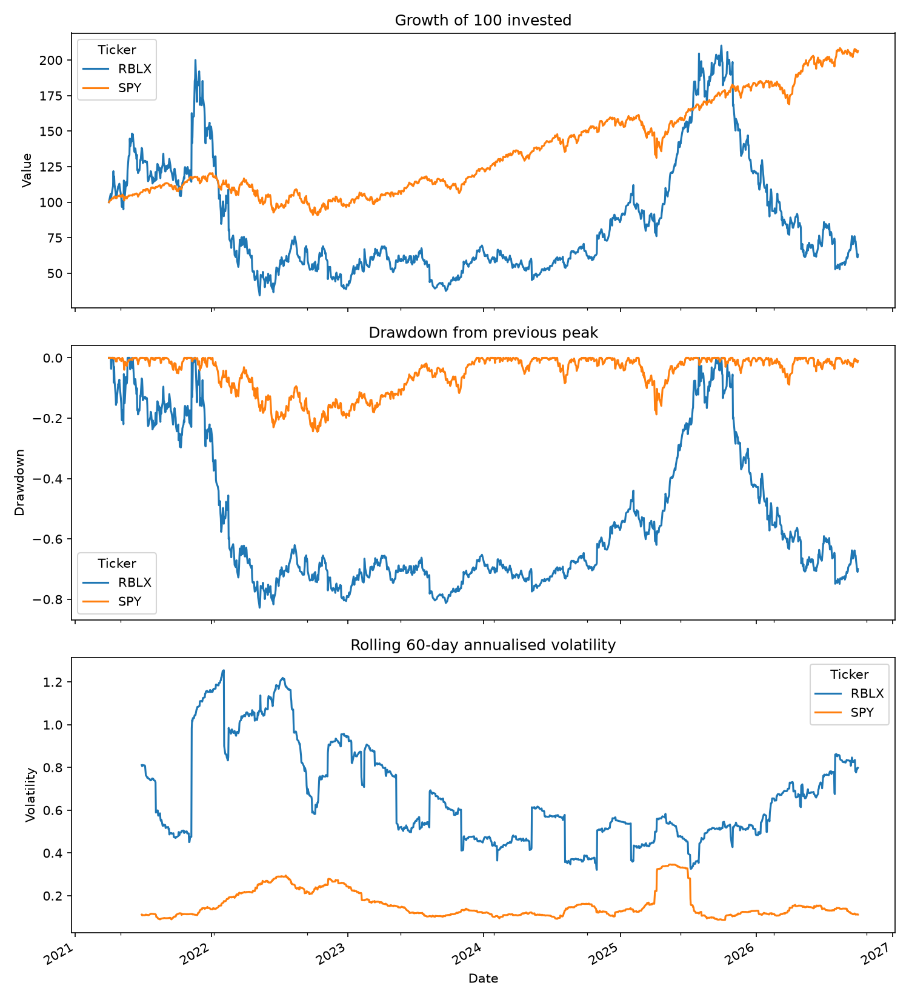

# RBLX Risk Analysis

A Python analysis of Roblox (RBLX) against the S&P 500 (via the SPY ETF), testing whether RBLX's returns were worth the risk of holding it. Built with pandas, NumPy and matplotlib using daily price data from Yahoo Finance.

**Period:** 1 Apr 2021 to 30 Sep 2026 (1,380 trading days)

## Results

| Metric | RBLX | SPY (S&P 500) |
|---|---|---|
| CAGR (compound return) | -8.0% | 14.1% |
| Avg annual return (arithmetic) | 16.5% | 14.6% |
| Annualised volatility | 70.6% | 16.7% |
| Sharpe ratio | 0.18 | 0.64 |
| Beta vs S&P 500 | 1.69 | 1.00 |
| Max drawdown | -82.8% | -24.5% |
| 1-day 95% VaR | 6.4% | 1.6% |



## Findings

- **RBLX was far riskier and paid worse.** Its volatility was over 4x the index's, it fell 83% from peak to trough, and its Sharpe ratio was 0.18 against 0.64.
- **Average returns can mislead.** RBLX's arithmetic average annual return was +16.5%, yet an investor who held it lost 8.0% a year. This is volatility drag: large swings reduce compounded growth. The gap is roughly half the variance, which is why I report both CAGR and the average.
- **High beta.** A beta of 1.69 means RBLX tended to move about 69% more than the market on a given day.
- **Tail risk.** The 95% VaR says RBLX lost more than 6.4% in a single day on roughly 1 day in 20.

## Limitations

- The window starts just after RBLX listed, so results are sensitive to the start date.
- It covers one stock. Historical risk is not a forecast of future risk.
- Historical VaR does not describe how bad the worst days can be.
- A 4% risk-free rate is assumed for the Sharpe ratio.

## How to run

```bash
pip install yfinance pandas numpy matplotlib
python rblx_risk_analysis.py
```

If yfinance is unavailable, download RBLX.csv and SPY.csv from Yahoo Finance into the same folder.
